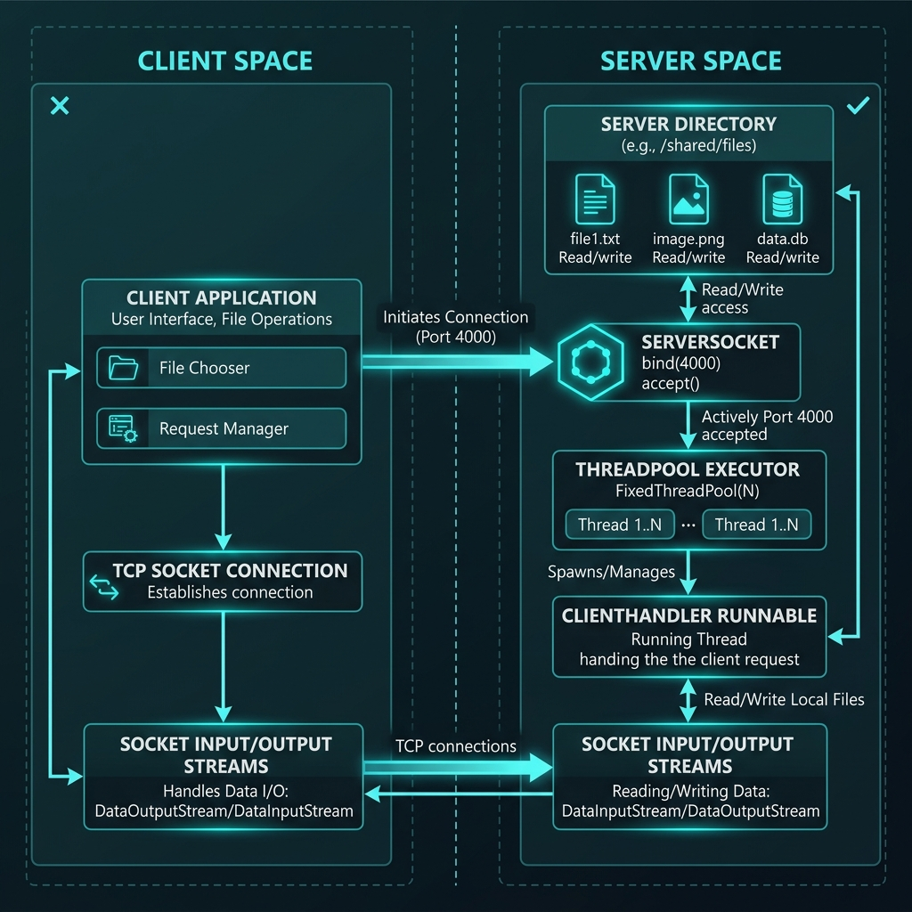
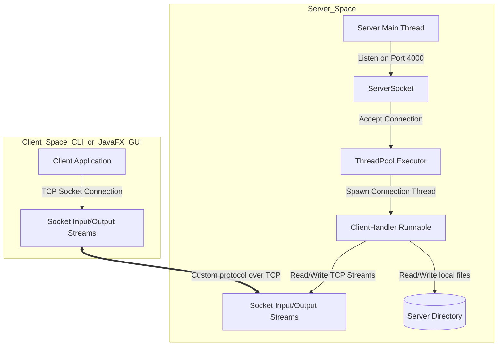
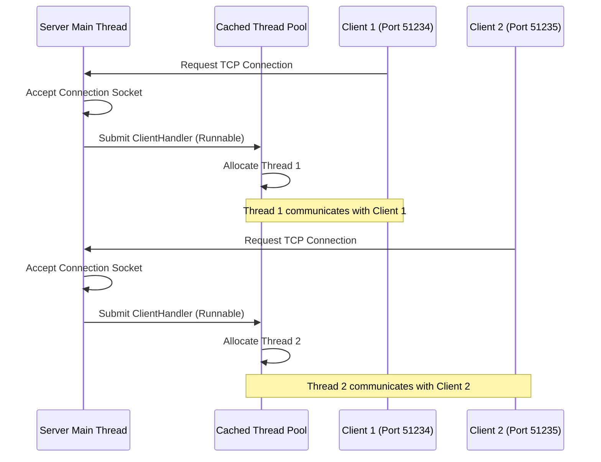
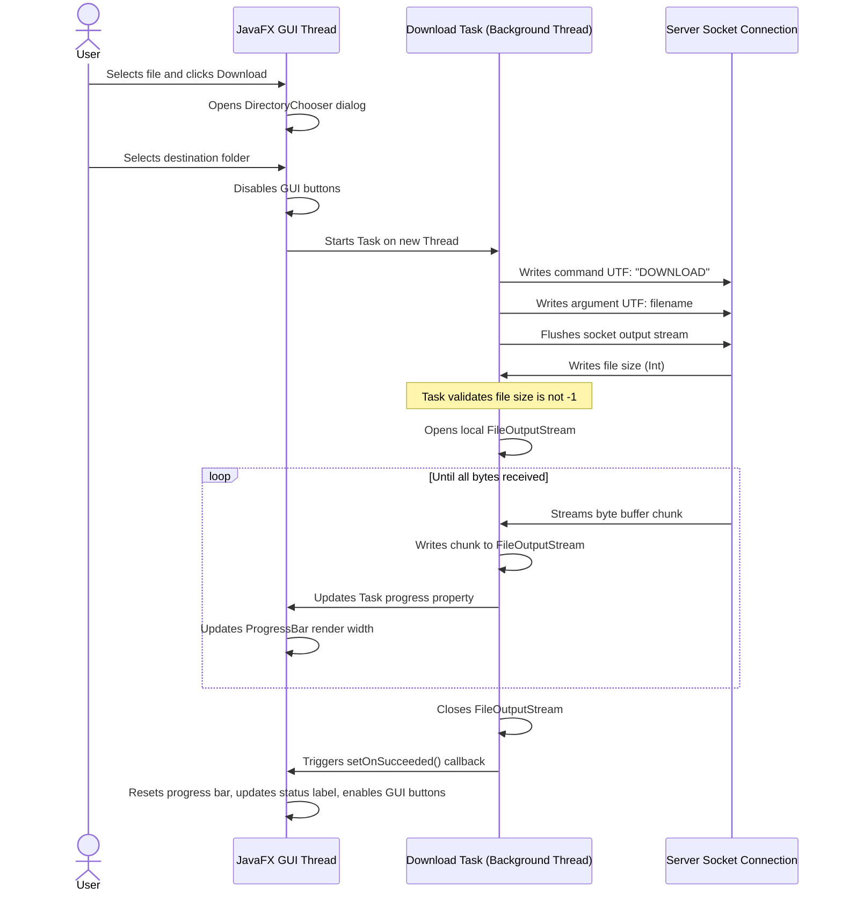

# Java File-Sharing System: Architectural & Code Guide

Welcome to the comprehensive technical and conceptual guide for the **Java File-Sharing System**. This document is designed to serve as both a deep architectural reference and a programming textbook. Whether you are a student learning socket programming, a developer seeking to understand JavaFX GUI bindings, or an engineer reviewing the concurrency model, this guide will walk you through the codebase, explaining not just *what* the code does, but *why* and *how* it does it.

---

## Table of Contents
1. [Project Overview & Architecture](#1-project-overview--architecture)
2. [Networking Fundamentals](#2-networking-fundamentals)
3. [Concurrency & Multithreading](#3-concurrency--multithreading)
4. [File I/O & Storage Management](#4-file-io--storage-management)
5. [File-by-File Summary](#5-file-by-file-summary)
6. [Class-by-Class Architectural Analysis](#6-class-by-class-architectural-analysis)
7. [Method-by-Method Analysis](#7-method-by-method-analysis)
8. [Critical Code Line-by-Line Breakdown](#8-critical-code-line-by-line-breakdown)
9. [Java Programming Language Concepts Exploded](#9-java-programming-language-concepts-exploded)
10. [End-to-End Execution Trace](#10-end-to-end-execution-trace)
11. [Design Evaluation & Refactoring Opportunities](#11-design-evaluation--refactoring-opportunities)

---

## 1. Project Overview & Architecture

### The Purpose and Problem Solved
At its core, this project is a **client-server TCP application** that allows remote computers to share files. 
In traditional local operating systems, files are moved between directories via local system calls (like `copy` or `move`). However, once files need to cross the boundary of a network, local filesystems cannot communicate directly. 

This application bridges that gap by establishing a **custom communication protocol** over raw TCP sockets. It provides:
1. A **Server** that runs indefinitely, listening for connections, managing a repository folder (`server/`), and handling file uploads and downloads.
2. A **CLI Client** for terminal-based operation.
3. A **JavaFX GUI Client** that provides a modern visual interface with live progress bars, responsive layout components, connection metrics, and dynamic filtering.

### Architectural Diagram
The system follows a classic **Client-Server Architecture**. Below is a visual representation of how the components interact:



Alternatively, here is the Mermaid diagram:



### Execution Flow
1. The **Server** starts, instantiating a `ServerSocket` bound to port `4000` and initializing a cached thread pool.
2. A **Client** (either CLI or JavaFX GUI) opens a connection to the Server's IP and port.
3. The Server's main thread accepts the connection and wraps the socket in a `ClientHandler` runnable, passing it to the thread pool.
4. The Client and `ClientHandler` exchange command tokens (`LIST`, `UPLOAD`, `DOWNLOAD`, or `EXIT`) using synchronized binary streams.
5. Files are streamed as chunked byte arrays, allowing transfers to complete without exhausting server memory.

---

### Learning Notes: Section 1
> [!NOTE]
> Client-server communication is the backbone of the modern internet. Standard web browsers (HTTP clients) communicate with web servers in a similar fashion, albeit using a standardized protocol rather than a custom one.

#### Key Takeaways
* **Clients** initiate connections; **servers** listen and respond.
* Sockets represent network endpoints for read and write operations.
* A custom protocol defines the semantic rules for communication (e.g., sending `LIST` to request files).

#### Common Interview Questions
1. **What is the difference between a Client-Server architecture and a Peer-to-Peer (P2P) architecture?**
   * *Answer*: In a client-server architecture, roles are asymmetric; the server is a centralized resource provider, and the client is a consumer. In P2P, every node (peer) acts as both a client and a server, sharing resources directly without a central authority.
2. **Why do we need a custom protocol format?**
   * *Answer*: Without a protocol, raw bytes arriving over a network are meaningless. A protocol provides structure (e.g., "the first 4 bytes are the file size, followed by the file contents"), enabling both sides to interpret the data stream identically.

---

## 2. Networking Fundamentals

### Sockets and Ports Explained
To understand how clients and servers talk, imagine a apartment building:
* The **IP Address** is the street address of the building.
* The **Port** is a specific apartment number.
* A **Socket** is the actual telephone line installed inside that specific apartment.

In Java:
* `ServerSocket` is a specialized socket that waits for incoming "calls" (connections).
* `Socket` is the connection endpoint used by both the client and server once a connection is active.

### TCP vs. UDP
This project uses **TCP (Transmission Control Protocol)** rather than **UDP (User Datagram Protocol)**.

| Feature | TCP | UDP |
| :--- | :--- | :--- |
| **Connection Style** | Connection-oriented (Handshake required) | Connectionless (Fire-and-forget) |
| **Reliability** | Guaranteed delivery, automatic retries | Unreliable, packets can be lost |
| **Ordering** | Guarantees packets arrive in order | Packets can arrive in any order |
| **Use Case here** | **File Sharing**: A single lost byte corrupts a file. | Video streaming or gaming (speed is prioritized over accuracy). |

### Stream-Based Communication
TCP is a **stream-oriented** protocol, not a message-oriented one. Data is transmitted as a continuous, unstructured sequence of bytes. 
* To send structured data (like strings or integers) over this stream, Java provides decorator classes: `DataInputStream` and `DataOutputStream`.
* These classes serialize primitives into standard binary formats. For example, `writeInt(42)` writes exactly 4 bytes representing the integer 42, which the other end reads using `readInt()`.

---

### Learning Notes: Section 2
> [!IMPORTANT]
> Because TCP is stream-based, if you write 100 bytes into a socket, the receiving end might read those 100 bytes in a single operation, or it might receive them in small chunks of 10, 50, and 40 bytes. Your application logic must account for this by continuing to read until the expected amount of data has been fully consumed.

#### Key Takeaways
* **Port 4000** is used as our default logical communication channel.
* Sockets wrap the OS-level TCP/IP network stack.
* Stream decorators allow us to write primitive Java data types directly to the network interface.

#### Common Interview Questions
1. **What is a TCP 3-way handshake?**
   * *Answer*: It is the process used to establish a TCP connection. The client sends a `SYN` (Synchronize) packet, the server responds with a `SYN-ACK` (Synchronize-Acknowledge), and the client replies with an `ACK`. This confirms that both input and output channels are functional.
2. **What happens if two applications attempt to bind to the same port on a single computer?**
   * *Answer*: The operating system throws a `BindException` (or "Address already in use") because a port can only be bound to a single listener process at a time.

---

## 3. Concurrency & Multithreading

### The Thread-per-Client Model
If a server only had a single thread of execution, it could only handle one client at a time:

```
[Server Thread] ---> Handles Client A (Blocks on Socket Read) ---> Client B is stuck waiting
```

To support multiple clients simultaneously, we implement the **Thread-per-Client** pattern:



### Cached Thread Pool (`ExecutorService`)
Instead of manually creating a new Java `Thread` object for every connection (which is slow and memory-intensive), the server uses a **Cached Thread Pool**:
* `Executors.newCachedThreadPool()` creates a pool that dynamically allocates threads as needed.
* If a thread becomes idle, it is kept alive for 60 seconds to see if it can be reused for a new client.
* This optimization prevents the overhead of creating and destroying thread objects continuously.

### Thread Safety in JavaFX
JavaFX, like most modern UI toolkits (including Swing and Android), is **single-threaded**.
* **Rule**: You cannot modify any visual component (e.g., updating a `ProgressBar` or changing a `Label` text) from a background worker thread. Doing so triggers an exception or causes unpredictable rendering bugs.
* **Solution**: The GUI client uses JavaFX `Task<V>` and `Platform.runLater()`.
  * `Task` represents a unit of work (e.g., file transfer) designed to run on a background thread.
  * We can bind progress and status properties of the `Task` to visual elements. JavaFX automatically schedules these updates on the main **JavaFX Application Thread** safely.
  * For asynchronous UI updates outside of Task properties, `Platform.runLater(Runnable)` queues a UI action to be run by the FX thread at the next opportunity.

---

### Learning Notes: Section 3
> [!TIP]
> Never block the JavaFX Application Thread. If you perform a network operation (like `socket.connect()`) directly on the UI thread, the entire user interface will freeze and become completely unresponsive. Always delegate network operations to background threads.

#### Key Takeaways
* Concurrency allows applications to run multiple tasks in parallel.
* Thread pools manage thread lifecycles efficiently.
* UI toolkits are strictly single-threaded to avoid complex concurrency overhead (locking) on visual components.

#### Common Interview Questions
1. **What is a race condition?**
   * *Answer*: A race condition occurs when two or more threads access shared data concurrently, and at least one thread modifies it. The final outcome depends on the exact execution order of the threads, leading to unpredictable behavior.
2. **What is the difference between `Thread.start()` and `Runnable.run()`?**
   * *Answer*: Calling `Thread.start()` creates a new operating system thread and runs the `run()` method inside that new execution context. Calling `run()` directly on a `Runnable` object simply executes the code on the *current* thread, like a standard method call, without spinning up a new thread.

---

## 4. File I/O & Storage Management

### File Streaming vs. Loading in Memory
A common beginner mistake when transferring files over a network is loading the entire file into an in-memory byte array:
```java
// DANGEROUS!
byte[] fileContent = new byte[(int) file.length()];
```
If a file is 2 GB and the server heap is limited to 512 MB, this code throws an `OutOfMemoryError` and crashes the entire application.

To solve this, our project uses **stream-based chunking**:
1. Allocate a small, fixed-size temporary buffer (e.g., `4096 bytes` or `4 KB`).
2. Read a chunk of bytes from the file (or socket).
3. Write that chunk immediately to the socket (or file).
4. Repeat until the entire file is transferred.
At any point in time, only 4 KB of memory is being consumed, allowing files of virtually infinite size to be transferred safely.

```mermaid
graph LR
    A[Source File/Socket] -->|Read 4KB| B[Buffer byte[]]
    B -->|Write 4KB| C[Destination File/Socket]
    C -->|Loop until done| A
```

### Try-With-Resources and File Leaks
Operating systems limit the number of open files a single program can have. If you open a file stream and forget to close it, that "file handle" remains locked by the OS, causing a resource leak.
To guarantee cleanup, Java introduces the **Try-with-Resources** statement:
```java
try (FileOutputStream fos = new FileOutputStream(file)) {
    // Write data
} // Java automatically calls fos.close() here, even if an exception occurs
```
Any class implementing the `AutoCloseable` interface can be used inside a try-with-resources statement.

---

### Learning Notes: Section 4
> [!IMPORTANT]
> Always check the return value of stream read operations. The `read(buffer)` method returns an integer representing how many bytes were actually read into the buffer. This number can be *less* than the size of the buffer, especially at the end of a file or network stream. Writing the entire buffer instead of the actual read length will result in corrupted files containing trailing garbage data.

#### Key Takeaways
* Buffering reduces the number of expensive system-level disk read/write requests.
* Try-with-resources prevents resource leaks by guaranteeing stream closure.
* File sizes must be validated *prior* to streaming to avoid server storage exhaustion.

#### Common Interview Questions
1. **Why does `InputStream.read()` return `-1`?**
   * *Answer*: It returns `-1` to signal the End-of-Stream (EOF). For files, this means the end of the file was reached. For network sockets, it indicates the remote side has shut down its output stream.
2. **What does flushing an output stream do?**
   * *Answer*: Writing to a stream often buffers the data in memory to optimize performance. Calling `flush()` forces any buffered bytes to be written out immediately to the underlying physical destination (disk or network card).

---

## 5. File-by-File Summary

Here is an architectural map of the project files:

| File Name | Location | Primary Purpose | Key Interactions |
| :--- | :--- | :--- | :--- |
| [Server.java](file:///C:/Users/glenn/Documents/Programming/My%20Projects/file-sharing-system/src/main/java/Server.java) | `src/main/java/` | Server entry point. Sets up the socket listener loop. | Spawns `ClientHandler` runnables inside a thread pool. |
| [ClientHandler.java](file:///C:/Users/glenn/Documents/Programming/My%20Projects/file-sharing-system/src/main/java/ClientHandler.java) | `src/main/java/` | Runs on background threads. Manages the connection lifecycle for a single client. | Reads/writes to the client's network streams. Manages the local `server/` directory files. |
| [Launcher.java](file:///C:/Users/glenn/Documents/Programming/My%20Projects/file-sharing-system/src/main/java/Launcher.java) | `src/main/java/` | Workaround classpath launcher. | Delegates execution directly to `Main.java`. |
| [Main.java](file:///C:/Users/glenn/Documents/Programming/My%20Projects/file-sharing-system/src/main/java/Main.java) | `src/main/java/` | JavaFX Application wrapper. Initializes stages (windows). | Loads `main-view.fxml` layouts and hooks up `MainController`. |
| [MainController.java](file:///C:/Users/glenn/Documents/Programming/My%20Projects/file-sharing-system/src/main/java/MainController.java) | `src/main/java/` | JavaFX GUI event handler. Handles GUI layout states, network sockets, and threads. | Communicates over TCP with the server. Updates UI elements based on background `Task` updates. |
| [FileItem.java](file:///C:/Users/glenn/Documents/Programming/My%20Projects/file-sharing-system/src/main/java/FileItem.java) | `src/main/java/` | Model representation. | Used by `MainController` to populate JavaFX TableView lists. |
| [Client.java](file:///C:/Users/glenn/Documents/Programming/My%20Projects/file-sharing-system/src/main/java/Client.java) | `src/main/java/` | CLI-based client application. | Communicates over TCP with the server via console inputs. |

---

## 6. Class-by-Class Architectural Analysis

---

### Class: `Server`
* **Purpose**: Acts as the system-wide bootstrap entry point for the backend server.
* **Design Decisions**:
  * Decoupled design: It only accepts connections and hands them off. It has no knowledge of *how* clients communicate. This keeps the listening loop lightweight and prevents blocking issues.
* **Relationships**:
  * Spawns [ClientHandler](file:///C:/Users/glenn/Documents/Programming/My%20Projects/file-sharing-system/src/main/java/ClientHandler.java) instances.
  * Uses `java.util.concurrent.ExecutorService` to manage concurrency.
* **Alternative Approaches**:
  * Instead of a cached thread pool, we could use a single-threaded server (blocks other clients) or NIO (Non-blocking I/O using Selectors). Java NIO is more scalable for thousands of idle connections but introduces significantly more complexity.
* **OOP Concepts Utilized**:
  * *Abstraction*: Hides the underlying operating system socket management behind simple Java objects (`ServerSocket` and `Socket`).

---

### Class: `ClientHandler`
* **Purpose**: Represents the execution logic running on the server to handle a single connected client.
* **Design Decisions**:
  * Implements `Runnable`, allowing it to be executed in parallel threads.
  * Employs stateful command processing (the connection is kept alive in a `while(true)` loop until the client explicitly disconnected).
* **Relationships**:
  * Directly controls the client connection `Socket`.
  * Manipulates the server's filesystem directory.
* **Alternative Approaches**:
  * Could use an asynchronous message queue architecture. However, direct synchronous request-response sockets are highly performant and simpler to debug for point-to-point connections.
* **OOP Concepts Utilized**:
  * *Encapsulation*: The `Socket` connection, `DataInputStream`, and `DataOutputStream` are kept `private`. The client cannot manipulate these directly; instead, they can only run valid protocol actions.

---

### Class: `Launcher`
* **Purpose**: Serves as a modular helper.
* **Design Decisions**:
  * Starting from a class that does not extend `javafx.application.Application` tricks the Java Virtual Machine (JVM). It stops the runtime from checking if JavaFX libraries are registered as JDK modules, allowing them to load dynamically from the local classpath.
* **Relationships**:
  * Calls static methods inside `Main`.

---

### Class: `Main`
* **Purpose**: Entry point for JavaFX GUI creation.
* **Design Decisions**:
  * Extends `javafx.application.Application` to spin up the UI thread loop.
  * Provides a public static helper method (`createNewClientWindow()`) to launch multiple concurrent dashboards.
* **Relationships**:
  * Loads `main-view.fxml` resources and parses them into visual layout objects.
* **OOP Concepts Utilized**:
  * *Inheritance*: Inherits fundamental window lifecycle hooks (`start()`, `stop()`) from `javafx.application.Application`.

---

### Class: `MainController`
* **Purpose**: Connects the XML-defined layout views with the backend networking logic.
* **Design Decisions**:
  * Extensive usage of JavaFX dynamic properties (`SimpleStringProperty`, `ObservableList`) to make the GUI responsive.
  * Offloads long-running network connections to background `Thread` instances using JavaFX `Task`.
* **Relationships**:
  * Tied directly to the scene graph elements annotated with `@FXML`.
  * Manages socket streams.
  * Populates a list of `FileItem` records.
* **Alternative Approaches**:
  * Model-View-Presenter (MVP) or Model-View-ViewModel (MVVM) architectures could be implemented. This single-controller structure keeps the code concise and highly readable.
* **OOP Concepts Utilized**:
  * *Dependency Management*: The controller accepts its parent `Stage` dependency via a setter method, allowing it to close or rename the window dynamically based on connection status.

---

### Class: `FileItem` (Record)
* **Purpose**: An immutable record modeling file properties.
* **Design Decisions**:
  * Created as a Java **Record** (introduced in Java 14) rather than a traditional class to eliminate boilerplate code like getters, setters, constructors, `toString()`, and `equals()`.
* **Relationships**:
  * Held by the `ObservableList` inside `MainController` to populate tables.

---

### Class: `Client` (CLI)
* **Purpose**: Provides a console-based alternative to the JavaFX GUI.
* **Design Decisions**:
  * Simple menu loop using `Scanner` input.
  * Shares the exact same protocol structure as the JavaFX client to guarantee server compatibility.
* **Relationships**:
  * Manages its own connection socket and writes to local directory names mapped to its dynamic connection port.

---

### Learning Notes: Section 6
> [!TIP]
> Choose Records whenever you need simple, immutable data carriers. They clarify developer intent and prevent accidental side effects since their fields cannot be changed after creation.

#### Key Takeaways
* JavaFX controllers coordinate visual events (button clicks) with model state.
* The JavaFX launcher class is a workaround for classpath configuration limitations.
* Object-oriented encapsulation guarantees that application state (like open sockets) is never modified unsafely by external actors.

#### Common Interview Questions
1. **What is a Java Record, and how does it differ from a traditional Class?**
   * *Answer*: A Java Record is a special kind of class type designed to hold immutable data. Unlike traditional classes, records automatically generate a constructor, getters for all fields, `equals()`, `hashCode()`, and `toString()`. Record fields are final and cannot be modified.
2. **Why do we separate Controller logic from Application setup?**
   * *Answer*: This separation of concerns aligns with the MVC (Model-View-Controller) design pattern. The Application class manages structural window creation, while the Controller manages interaction logic, making the code easier to maintain and test.

---

## 7. Method-by-Method Analysis

---

### File: `Server.java`

#### Method: `main(String[] args)`
* **Purpose**: Boots the server, opens port 4000, and loops indefinitely to accept clients.
* **Parameters**: `String[] args` - optional terminal arguments.
* **Execution Flow**:
  1. Instantiates a cached thread pool using `Executors.newCachedThreadPool()`.
  2. Opens a `ServerSocket` bound to port `4000` inside a try-with-resources block.
  3. Enters an infinite `while(true)` loop.
  4. Calls `serverSocket.accept()`, which blocks until a client connects.
  5. Upon connection, prints client info and instantiates a `ClientHandler` runnable.
  6. Submits the handler to the thread pool for parallel execution.
* **Why this implementation works**: The thread pool manages thread reuse, protecting the system from performance degradation during client churn.
* **Potential improvements**: Add a graceful shutdown handler (e.g., catching termination signals) to shut down the thread pool and notify connected clients.

---

### File: `ClientHandler.java`

#### Method: `run()`
* **Purpose**: Coordinates communication for a specific client socket until disconnection.
* **Execution Flow**:
  1. Wraps raw socket input/output streams inside binary `DataInputStream`/`DataOutputStream` containers.
  2. Enters a message processing loop.
  3. Calls `dataInputStream.readUTF()` (blocks until a command string arrives).
  4. Matches the command using a `switch` statement (`UPLOAD`, `LIST`, `DOWNLOAD`, or `EXIT`).
  5. Invokes the appropriate helper method.
  6. If `EXIT` or EOF (end of file) is received, breaks the loop and executes the `cleanup()` method.

#### Method: `receiveFile()`
* **Purpose**: Reads incoming file data from the network and writes it to the server's directory.
* **Execution Flow**:
  1. Reads file name (UTF string) and file size (integer).
  2. Resolves path inside `server/` folder and creates parent directories if needed.
  3. Allocates a `4KB` byte array.
  4. Loops until the total bytes read matches the expected file size.
  5. Calls `read()` on the socket, limiting the buffer size to the remaining file length using `Math.min()`.
  6. Writes bytes to `FileOutputStream`.
* **Potential improvements**: Check if the client is sending a path with malicious traversal elements (e.g. `../`) to avoid file system attacks.

#### Method: `sendFileNames()`
* **Purpose**: Lists files stored in the `server/` directory and returns them to the client.
* **Execution Flow**:
  1. Verifies the `server` directory exists.
  2. Calls `listFiles()` to gather file handles.
  3. Transforms the list into formatted strings (`name:size`) using Java Streams.
  4. Sends the formatted list back to the client as a single UTF string.

#### Method: `sendFile()`
* **Purpose**: Streams a requested file to the client.
* **Execution Flow**:
  1. Reads the target file name.
  2. Checks if file exists and is not a directory. If invalid, writes `-1` to output.
  3. Otherwise, writes the file length (integer).
  4. Instantiates a `FileInputStream` and streams file contents to the output socket in `4KB` chunks.

---

### File: `MainController.java`

#### Method: `initialize()`
* **Purpose**: Configures UI elements on application startup.
* **Execution Flow**:
  1. Configures TableView columns to read properties from the `FileItem` model.
  2. Sets `CONSTRAINED_RESIZE_POLICY` on the table to eliminate empty column spacing.
  3. Initializes a `FilteredList` wrapping the master data list.
  4. Attaches a listener to the search field to update the filter predicate whenever text changes.

#### Method: `connect()`
* **Purpose**: Establishes connection to the server asynchronously.
* **Execution Flow**:
  1. Parses the host and port string entered by the user.
  2. Instantiates a JavaFX `Task`.
  3. Inside the task's background context, creates `new Socket(host, port)` and gets streams.
  4. Hooks up callbacks for `setOnSucceeded` (enables GUI controls, starts automatic refresh) and `setOnFailed` (shows connection error dialog).
  5. Starts the task on a new background thread.

#### Method: `handleUpload(ActionEvent event)`
* **Purpose**: Initiates a background file upload task.
* **Execution Flow**:
  1. Opens a native `FileChooser` file dialog.
  2. Validates that the file size is under the 50 MB limit.
  3. Disables action buttons on the GUI.
  4. Creates a `Task` that sends the "UPLOAD" token, file name, and file size, and streams file bytes in 4KB chunks.
  5. Binds the task's properties to the progress bar and status label.
  6. Upon completion, unbinds properties, resets the progress bar, and refreshes the remote file list.

---

### Learning Notes: Section 7
> [!NOTE]
> Releasing resources (closing streams and sockets) in the `finally` block is a critical defensive programming pattern. If you close them inside the main body of your code, any exception thrown before the close line will skip execution, leaving resources leaked.

#### Key Takeaways
* `DataInputStream.readUTF()` uses a modified UTF-8 encoding format prefix to manage string reading automatically.
* Sockets must be closed from the connection owner to prevent dead connections on the server.
* Java Streams provide elegant solutions for formatting file lists.

#### Common Interview Questions
1. **Why do we use `Math.min(buffer.length, fileLength - totalBytesRead)` when reading a file from a socket?**
   * *Answer*: Because sockets are continuous streams, if we read a full `4096` byte buffer near the end of a file, we might read bytes belonging to a *subsequent* command sent by the client. Using `Math.min` ensures we only read up to the exact boundary of the file payload, preserving protocol synchronization.
2. **What does binding properties mean in JavaFX?**
   * *Answer*: Binding is a mechanism that links the value of one property (the source, like a Task's progress) to another property (the target, like a ProgressBar's progress value). When the source changes, the target updates automatically.

---

## 8. Critical Code Line-by-Line Breakdown

Let us examine the file copy loop in [ClientHandler.receiveFile()](file:///C:/Users/glenn/Documents/Programming/My%20Projects/file-sharing-system/src/main/java/ClientHandler.java#L78-L90):

```java
try (FileOutputStream fileOutputStream = new FileOutputStream(file)) {
    byte[] buffer = new byte[4096];
    int totalBytesRead = 0;
    while (totalBytesRead < fileLength) {
        int bytesToRead = Math.min(buffer.length, fileLength - totalBytesRead);
        int bytesRead = dataInputStream.read(buffer, 0, bytesToRead);
        if (bytesRead == -1) {
            throw new EOFException("Client disconnected before upload completed.");
        }
        fileOutputStream.write(buffer, 0, bytesRead);
        totalBytesRead += bytesRead;
    }
}
```

### Line-by-Line Analysis
* **Line 1: `try (FileOutputStream fileOutputStream = new FileOutputStream(file))`**
  * `FileOutputStream` is a Java output stream class designed to write bytes directly to a physical file.
  * The instantiation is wrapped in a try-with-resources statement. This guarantees that when execution leaves this block, the file handle will be closed automatically, preventing file locks.
* **Line 2: `byte[] buffer = new byte[4096];`**
  * Declares a buffer (temporary storage) of 4096 bytes. This prevents high disk overhead by writing to the file in blocks instead of one byte at a time.
* **Line 3: `int totalBytesRead = 0;`**
  * Initializes an integer counter to keep track of how many bytes have been successfully read from the network socket.
* **Line 4: `while (totalBytesRead < fileLength)`**
  * A conditional loop that keeps reading from the socket until the accumulated bytes equal the file size (`fileLength`) sent in the protocol header.
* **Line 5: `int bytesToRead = Math.min(buffer.length, fileLength - totalBytesRead);`**
  * Calculates how many bytes we should request in the next read operation. We want a maximum of `4096` bytes, but if we are on the last chunk, we only want the exact remaining bytes (`fileLength - totalBytesRead`).
* **Line 6: `int bytesRead = dataInputStream.read(buffer, 0, bytesToRead);`**
  * Reads up to `bytesToRead` from the socket stream into the buffer starting at offset `0`.
  * The method blocks execution until network data arrives. It returns the number of bytes actually read.
* **Line 7-9: `if (bytesRead == -1) { throw new EOFException(...); }`**
  * If `bytesRead` is `-1`, it means the socket stream was closed unexpectedly by the client before all promised bytes were sent. We throw an `EOFException` to stop writing and trigger error handling.
* **Line 10: `fileOutputStream.write(buffer, 0, bytesRead);`**
  * Writes the bytes from the buffer to the file.
  * **Crucial Detail**: We specify the range using start offset `0` and length `bytesRead`. If we omit this and write the whole buffer, we risk writing stale data from the previous loop iteration.
* **Line 11: `totalBytesRead += bytesRead;`**
  * Increments our counter by the number of bytes processed in this iteration.

---

### Learning Notes: Section 8
> [!CAUTION]
> Writing files without offset limitations (`fos.write(buffer)`) is a major security and data integrity bug. Always use `write(buffer, 0, bytesRead)` when handling chunked I/O.

#### Key Takeaways
* `Math.min` guards stream boundaries.
* Checked exceptions (like `EOFException`) must be handled explicitly.
* Chunked file writes protect system memory.

---

## 9. Java Programming Language Concepts Exploded

This project showcases several fundamental Java concepts. Below is a detailed breakdown of each:

### 1. Java Record
A record is a special class type designed to represent immutable data. It is declared using the `record` keyword instead of `class`:
```java
public record FileItem(String name, String size, long sizeInBytes) {}
```
Behind the scenes, Java automatically creates:
* Private, final fields.
* A constructor that initializes all fields.
* Getters with the same name as the fields (e.g., `name()` instead of `getName()`).
* Implementations of `equals()`, `hashCode()`, and `toString()`.

### 2. Exceptions (Checked vs. Unchecked)
Java separates exceptions into two main categories:
1. **Checked Exceptions**: Exceptions that inherit from `java.lang.Exception` (excluding runtime exceptions). These are checked at compile-time. You must declare them in your method signature using the `throws` keyword or wrap them in a `try-catch` block. Examples in this project include `IOException`, `EOFException`, and `FileNotFoundException`.
2. **Unchecked Exceptions**: Exceptions that inherit from `java.lang.RuntimeException`. These are checked at run-time. Examples include `NumberFormatException` and `NullPointerException`.

### 3. Collections and Streams API
In `ClientHandler.java`, the files are mapped to strings using the Streams API:
```java
fileInfo = Arrays.stream(files)
                 .map(f -> f.getName() + ":" + f.length())
                 .toList();
```
* **`Arrays.stream(files)`**: Converts the array of File objects into a functional pipeline stream.
* **`map(lambda)`**: Applies a transformation function to each element. Here, it transforms a `File` object into a `String` (`name:size`).
* **`toList()`**: Terminal operation that collects the stream elements into an immutable `List`.

### 4. Lambdas and Functional Interfaces
Java FX uses lambdas to register event handlers and listeners:
```java
stage.setOnCloseRequest(event -> controller.shutdown());
```
`event -> controller.shutdown()` is a lambda expression. It provides a compact implementation of the `EventHandler` functional interface, which has a single abstract method, `handle(T event)`.

---

### Learning Notes: Section 9
> [!TIP]
> The Streams API is designed for functional style transformations. Avoid using stream maps to modify state external to the stream pipeline, as this violates functional programming principles and can cause thread synchronization bugs.

#### Key Takeaways
* Java Records simplify model layers.
* Checked exceptions enforce error-handling hygiene.
* Streams replace verbose nested loops with readable pipelines.

#### Common Interview Questions
1. **What is a functional interface?**
   * *Answer*: A functional interface is an interface that contains exactly one abstract method. They can be implemented using lambda expressions, method references, or constructor references. They are often annotated with `@FunctionalInterface`.
2. **What is the difference between `Stream.map()` and `Stream.flatMap()`?**
   * *Answer*: `map()` converts each element in a stream to another object (1-to-1 mapping). `flatMap()` converts each element into a stream of objects and flattens these streams into a single stream (1-to-many mapping).

---

## 10. End-to-End Execution Trace

Let's walk through what happens when a user clicks **Download** on the JavaFX GUI client.



### Detailed Trace Steps:
1. **UI Event Handled**: The user clicks the download button, triggering `handleDownload()` on the JavaFX Application Thread.
2. **Path Chooser Dialog**: A native folder directory dialog appears. Once selected, action buttons are disabled to prevent concurrent command issues on the socket.
3. **Task Dispatched**: A new `Task` is instantiated, and `new Thread(downloadTask).start()` is called to run it in a background thread.
4. **Command Sent**: The background thread sends the protocol sequence:
   * `"DOWNLOAD"`
   * `"[fileName]"`
5. **Server Processes Request**: The server thread running `ClientHandler.sendFile()` reads the request, verifies the file, writes the file length, and streams the raw bytes.
6. **Socket Stream Loop**: The client reads the size header, opens a local `FileOutputStream`, and enters a chunked socket-read loop.
7. **Progress Updates**: As bytes accumulate, `updateProgress(total, length)` is called. The JavaFX Application Thread intercepts this and updates the progress bar's visual rendering.
8. **Completion Callback**: The file stream closes. The background task finishes, triggering `setOnSucceeded()`. The GUI buttons are re-enabled, and a success status is printed.

---

## 11. Design Evaluation & Refactoring Opportunities

---

### Strengths
1. **Clean Thread Offloading**: Offloading heavy network operations to background tasks ensures a smooth, non-blocking user interface.
2. **Memory Efficiency**: Chunk-based file streams prevent `OutOfMemoryError` failures when handling large files.
3. **Encapsulation**: The JavaFX GUI layout is separated from logic controller classes, and network streams are safely encapsulated behind public protocols.

---

### Weaknesses & Security Concerns
1. **Path Traversal Vulnerability**:
   * *Problem*: In `ClientHandler.java`, the server saves files using:
     ```java
     File file = new File("server/" + fileName);
     ```
     If a malicious client uploads a file named `../../Windows/System32/cmd.exe` or `../../.bashrc`, the server will traverse outside the `server/` directory and overwrite critical system files.
   * *Fix*: Sanitize the filename to remove folder delimiters like `/` and `\`, and verify that the canonical path is within the target directory:
     ```java
     File file = new File("server/" + new File(fileName).getName());
     ```
2. **Integer Overflow for Large Files**:
   * *Problem*: The file size protocol headers are currently sent as 32-bit signed integers (`readInt()`/`writeInt()`).
     ```java
     int fileLength = dataInputStream.readInt();
     ```
     This limits maximum file size transfers to 2 GB. If a file is larger than 2 GB, the integer overflows, resulting in negative values and corrupted files.
   * *Fix*: Upgrade the protocol stream read/write calls to use 64-bit long integer headers (`readLong()`/`writeLong()`).
3. **No Timeout Guard on Connections**:
   * *Problem*: If a client connects and then crashes or stops sending data without closing the connection, the server's thread remains blocked on `readUTF()` indefinitely. This will eventually exhaust the thread pool.
   * *Fix*: Set a read timeout on the socket:
     ```java
     socket.setSoTimeout(30000); // 30 second read timeout
     ```

---

### Suggested Refactoring: Secure File Handler
Here is a secure refactoring of the file receiving logic in `ClientHandler.java`:

```java
private void receiveFileSecurely() throws IOException {
    String fileName = dataInputStream.readUTF();
    
    // Security Fix: Extract only the base name of the file to prevent path traversal
    File rawFile = new File(fileName);
    String sanitizedName = rawFile.getName();
    
    // Security Fix: Enforce exact directory boundaries
    File baseDir = new File("server").getCanonicalFile();
    File destinationFile = new File(baseDir, sanitizedName).getCanonicalFile();
    if (!destinationFile.getPath().startsWith(baseDir.getPath())) {
        throw new SecurityException("Unauthorized file write attempt outside server directory!");
    }

    // Protocol Fix: Read size as long to support files larger than 2GB
    long fileLength = dataInputStream.readLong(); 

    try (FileOutputStream fileOutputStream = new FileOutputStream(destinationFile)) {
        byte[] buffer = new byte[4096];
        long totalBytesRead = 0;
        while (totalBytesRead < fileLength) {
            int bytesToRead = (int) Math.min(buffer.length, fileLength - totalBytesRead);
            int bytesRead = dataInputStream.read(buffer, 0, bytesToRead);
            if (bytesRead == -1) {
                throw new EOFException("Connection lost during file transfer.");
            }
            fileOutputStream.write(buffer, 0, bytesRead);
            totalBytesRead += bytesRead;
        }
    }
}
```

---

### Learning Notes: Section 11
> [!WARNING]
> Always treat client input as untrusted. Filesystem paths, size headers, and command strings sent over the network should always be validated to protect your server.

#### Key Takeaways
* Path traversal is a common security vulnerability.
* Protocol size limits should match the range of the chosen data types.
* Read timeouts prevent socket leakage and protect server resource limits.

#### Common Interview Questions
1. **What is a path traversal attack, and how do you prevent it?**
   * *Answer*: Path traversal is an attack where a user inputs file paths containing directory traversal characters (like `../`) to access or modify files outside of the application's intended directory. You prevent it by sanitizing input paths to remove path components, extracting only the base filename, or checking that the resolved file path starts with the prefix of the authorized base directory.
2. **What happens if a TCP connection is disconnected abruptly without a close handshake?**
   * *Answer*: The socket remains open in a half-open state on the other machine, blocking on reads indefinitely. To prevent this, applications implement application-level keep-alives (heartbeats) or set socket read timeouts (`SO_TIMEOUT`).
