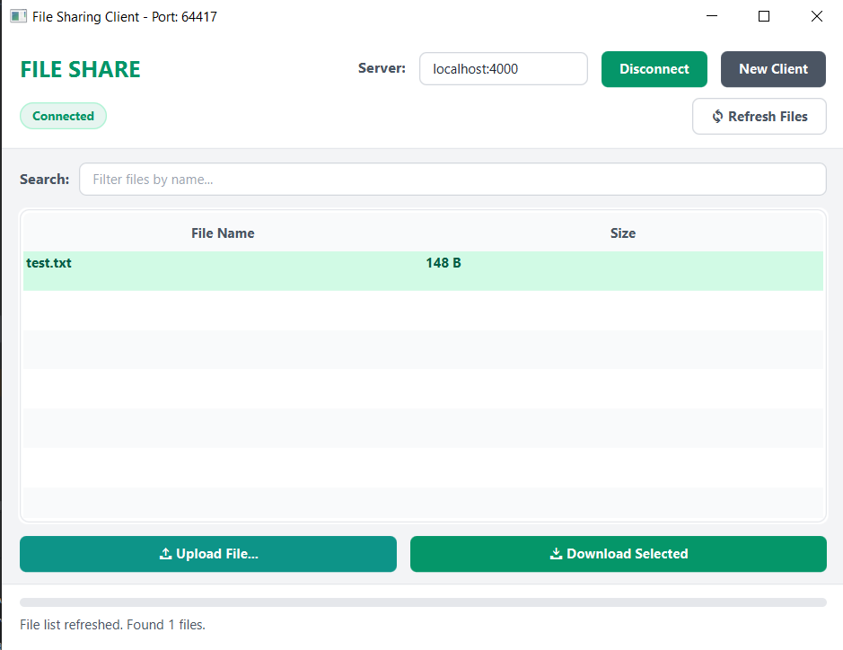

# File Sharing System

A lightweight, multithreaded TCP file-sharing system built in Java. It features both a modern **JavaFX Graphical User Interface (GUI)** client and a lightweight **Command Line Interface (CLI)** client, connected to a robust multithreaded backend server.



---

## Features

- **Multithreaded Server**: Handled using a cached thread pool to support multiple clients concurrently.
- **JavaFX Desktop Client (GUI)**:
  - Clean, responsive dashboard with Search/Filter capability.
  - Displays actual file names and formatted sizes (e.g., `KB`, `MB`).
  - Real-time download/upload progress bars and system status indicators.
  - Fully constrained layout to prevent blank placeholder spaces or alignment errors.
- **Command Line Client (CLI)**: Lightweight console interface to list, upload, and download files quickly.
- **Strict Limits**: Integrated safety safeguards such as a 50 MB upload limit per file to optimize server performance and storage.

---

## Project Structure

```
file-sharing-system/
├── src/
│   └── main/
│       ├── java/
│       │   ├── Server.java          # Server starter, listens on port 4000
│       │   ├── ClientHandler.java   # Runnable task handling single TCP client socket
│       │   ├── Launcher.java        # Workaround entrypoint for classpath launches
│       │   ├── Main.java            # Main JavaFX application window manager
│       │   ├── MainController.java  # Controller for GUI interactions, filters, and background threads
│       │   ├── FileItem.java        # Record modeling file metadata (name, size representation)
│       │   └── Client.java          # CLI client application
│       └── resources/
│           ├── main-view.fxml       # JavaFX structure layout
│           └── style.css            # Stylesheets for client custom design
├── server/                          # Folder created by the server containing shared files
├── pom.xml                          # Maven build configuration
└── README.md                        # Documentation
```

---

## System Architecture & Protocol

Clients communicate with the server over raw TCP sockets using a straightforward custom protocol:

- **`LIST`**: 
  - *Client sends*: `"LIST"`
  - *Server replies*: A serialized string list of files and sizes formatted as `"[filename1:size1, filename2:size2, ...]"`
- **`UPLOAD`**:
  - *Client sends*: `"UPLOAD"` -> File Name (String) -> File Size in Bytes (int) -> Raw File Payload (bytes)
  - *Server replies*: None (Server streams bytes directly to disk)
- **`DOWNLOAD`**:
  - *Client sends*: `"DOWNLOAD"` -> File Name (String)
  - *Server replies*: File Size in Bytes (int; returns `-1` if not found) -> Raw File Payload (bytes; if size > 0)
- **`EXIT`**:
  - *Client sends*: `"EXIT"` (Signals disconnection so server can clean up socket resources)

---

## Getting Started

To build and run the application, we recommend using an Integrated Development Environment (IDE) like **IntelliJ IDEA**, **Eclipse**, or **NetBeans**.

### Prerequisites
- **Java Development Kit (JDK) 17** or higher installed and configured in your IDE.

### Loading the Project in your IDE

1. **Open/Import the Project**:
   - Open your IDE.
   - Select **Open** or **Import Project** and choose the root directory containing the `pom.xml` file.
   - The IDE will automatically read the configuration and set up the JavaFX project dependencies.

2. **Wait for Synchronization**:
   - Allow a moment for the IDE to finish syncing and download JavaFX modules.

---

### Running the Application from your IDE

You can run the server and client components directly from your IDE code explorer:

1. **Start the Server**:
   - Navigate to [Server.java](file:///C:/Users/glenn/Documents/Programming/My%20Projects/file-sharing-system/src/main/java/Server.java).
   - Right-click the file and select **Run 'Server.main()'**.
   - The server console will print that it has started listening on port `4000`.

2. **Start the GUI Client**:
   - Navigate to [Launcher.java](file:///C:/Users/glenn/Documents/Programming/My%20Projects/file-sharing-system/src/main/java/Launcher.java).
   - Right-click the file and select **Run 'Launcher.main()'**.
   - The desktop file-sharing dashboard will open. Click **Connect** to link to the running server. You can click **New Client** to open additional independent client dashboards.

3. **Start the CLI Client (Optional)**:
   - Navigate to [Client.java](file:///C:/Users/glenn/Documents/Programming/My%20Projects/file-sharing-system/src/main/java/Client.java).
   - Right-click the file and select **Run 'Client.main()'**.
   - Use the IDE terminal/console to interact with the text menu.

---

## Configuration and Notes

- **Port Numbers**: Default socket connection is bound to port `4000` (`localhost:4000`).
- **File Upload Limits**: A built-in validation cap restricts file sizes to **50 MB** maximum to protect server storage.
- **Download Storage**:
  - **GUI Client**: Prompts you to pick a directory using a native file dialog.
  - **CLI Client**: Automatically saves downloaded files in a local folder named `client_<port>/`.
